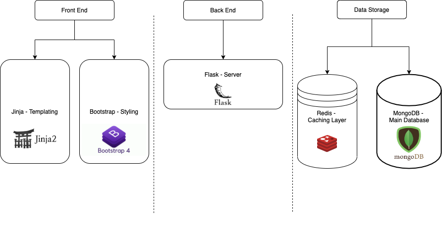
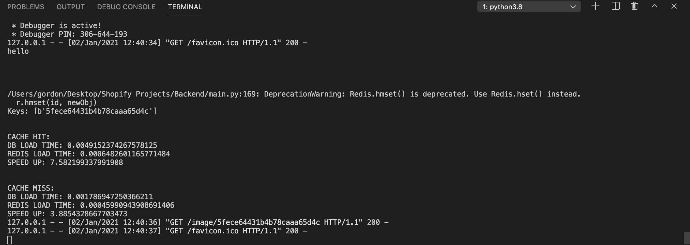

# Inventory List

### Overview
An inventory list application that uses restful routing and other backend engineering principles.

### Project Structure
For this application there are three distinct layers: the frontend which is responsible for rendering the inventory item list, the backend which is responsible for server side logic, and data storage used to save and retrieve inventory item data.

### How The Project Works
At the index route of this application, there will be a search bar, as well as a table that should be empty that displays all inventory items stored in MongoDB database. Inputting a value into the search bar allows you to filter the items in the database based on a string search functionality found in MongoDB. In the navbar at the very top of the application there is a “Home” button which is the index route that displays all items in the database, and there will also be a button for “add Item" which allows you to add an item to the database.

### How to Run Project
You will need to have the correct applications installed which can be found in the Conda txt file provided with the code. You will also need to have the Flask server running to use this application using the command "python main.py" in the terminal. In another terminal, you also need the Redis server running which is started using the command "redis-server". 

### Redis Caching Layer
I decided to include a Redis caching layer in the backend project because I knew Redis could greatly improve the speed at which inventory items would be retrieved from the backend. 
Retrieval from redis proves to be faster than using the MongoDB database for both cache hits and misses. A cache hit corresponds to when an inventory item (or the item's id) is found in the database, and a cache miss is for when the inventory item is not found.

In the image below I indicate the timing analysis used to compare the cache hit and cache miss speeds of redis when compared to mongodb.

As shown here where each retrieval of data was timed, Redis proves to be 3.9 times (or 290%) faster when the inventory item is not in Redis or MongoDB, and 7.6 times (or 660%) faster when inventory items are present within both Redis and MongoDB.
I chose to use Redis for the retrieval of a single inventory item because I realized that adding this caching logic to the index route would be the same as retrieving all the inventory items from MongoDB and storing them all into Redis as well. This is an infeasible step to take as when the Inventory List gets too large, the cache will not be efficiently utilized.
Therefore, the only route Redis is utilized in is the id specific route for an item, and this is because I realized that the items that are sent to the id specific route could be faster retrieved from Redis since it may be an item that is frequently clicked on.

### Testing
For testing I used an application called Postman to make sure that each route responded correctly.

### Potential Improvements
Creating authentication that ties the frontend to the backend could make this application better by allowing only those with proper access to an inventory items the ability to delete them. This could have been achieved with Firebase Authentication. Another improvement to the frontend I would have made would be utilizing React. This is because react is a nice framework that organizes the frontend. I would use Axios to connect React and my Flask server.

